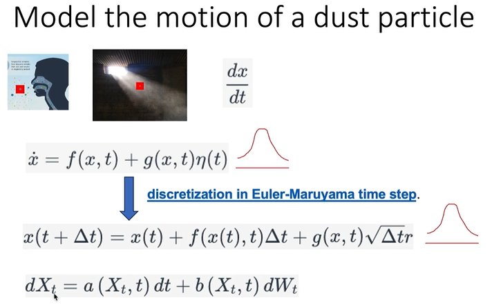
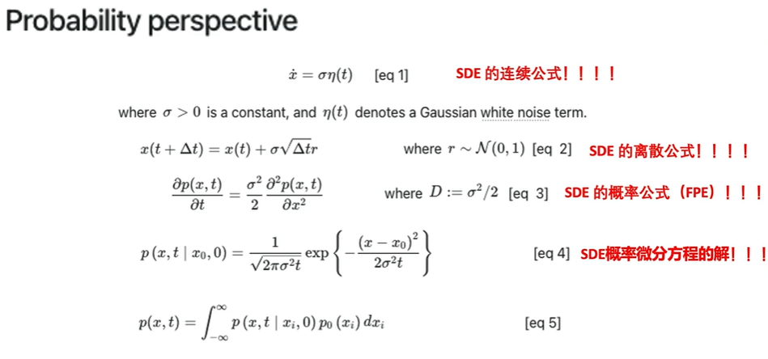
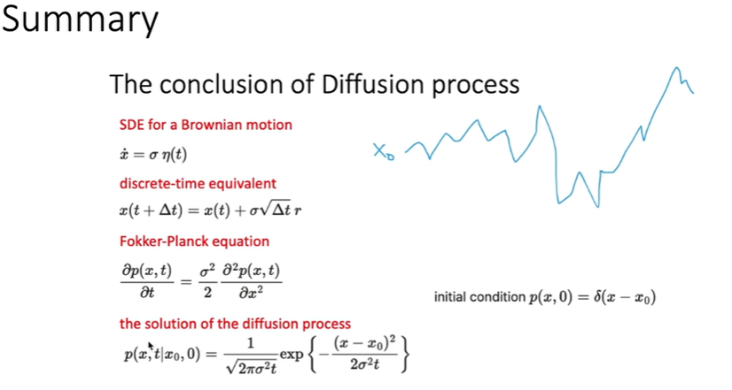
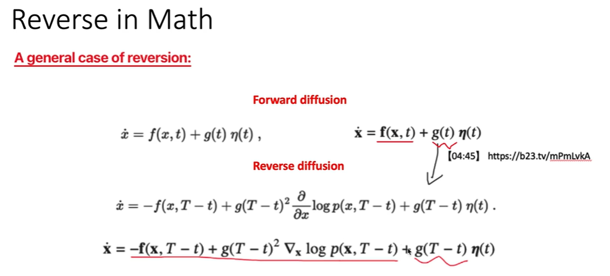
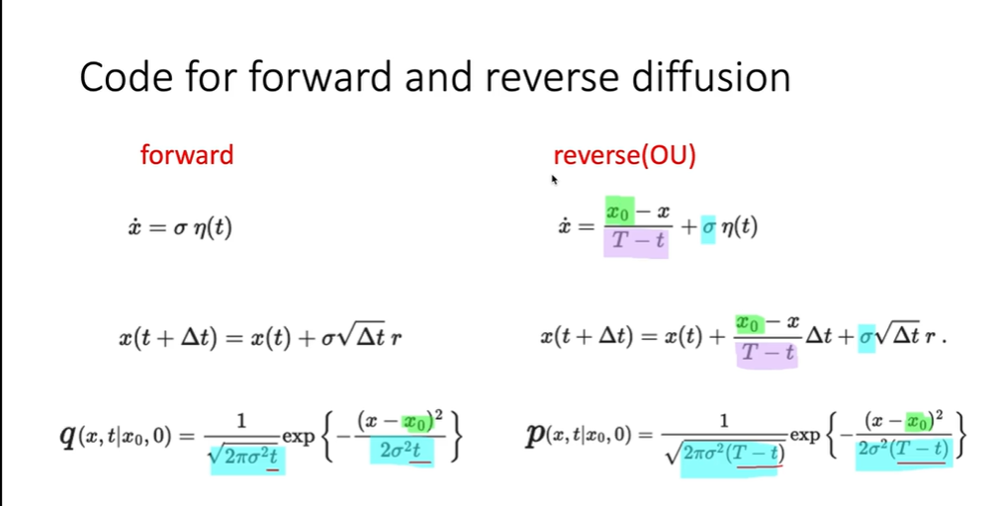

## 前向过程
### 首先介绍Stochastic Differential Equations (SDE) 随机微分方程
### 对SED进行离散化 x=f(x,t)+g(x,t)η(t)
### Euler-Maruyama method->
### x(t+dt)=x(t)+f(x(t),t)dt+g(x,t)sqrt(dt)*r   r是randn_normal()

### 若干公式

### Fokker-Planck equation

## 逆向过程
### 从形式上来看,forward_process和reverse_process都是SDE
### 只要是SDE 那么就有以下几个条性质
1.有连续的形式 
2.有离散的形式 
3.从概率角度出发,有Fokker-Planck equation 
4.有Fokker-Planck 的解 (i.e.P(x,t)) 
### 其中,横线是f,波浪线是g

## 代码思路

